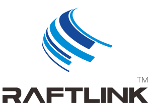

# RaftLink信息发布终端 WebApp编程指南


  
###### Guangzhou Fuhai Software Technology Co., Ltd.
###### 广州市孚海软件技术有限公司 出品
[Company website http://www.wifi-town.com](https://www.wifi-town.com/)


#### Histroy
|Version|Revision|Author|Date|
|:----- |:-------|:-----|----- |
|v1.0 |First initial version|Easion|2019-08-26 |


> 网站: 
**kuaipin.wifi-town.com**


## 1. 概论
  [RaftLink](https://raftlink.1688.com/)是广州市孚海软件技术有限公司的注册商标.
  
RaftLink信息发布终端是基于安卓的信息发布应用。用户可以自定义网页、幻灯片、视频三种类型的多媒体文件播出方式，默认的按照每6小时一个时间段，将全天划分成4个时间段，每个时间段可以播出不同的内容。
  
RaftLink信息发布终端可支持2个虚拟屏幕，我们建议用户采用WebApp的方式开发您的信息发布应用，可以通过WEB JavaScript代码实现不同屏幕的切换、播放单的读取和修改、文本转语音等功能。
  
我们设备提供JavaScript转native功能，它类似微信公众号的JSAPI功能，通过JS代码调用原生底层实现，设备更偏重于WEB对底层基本功能的操控，从而快速完成产品的上线并快速迭代开发。
    
    由于我们设备并非提供给普通用户，对JS调用权限并不检查调用者的来源，无需接口的签名校验操作。
    
[RaftLink设备购买地址](https://raftlink.1688.com/)
 
  - 
 ## 1.导入基础库

导入基础库，可从https://kuaipin.wifi-town.com/kp/下载下面文件。
```html
<head>
<--- 省略其他信息   --->
<script src="/kp/dsbridge.js"> </script>
<script src="/kp/fly.js"></script>
<script src="/kp/engine-wrapper.js"></script>
<script src="/kp/adapter.js"></script>
</head>
```

检查是否支持JSBridge
```js
var engine = EngineWrapper(dsbAdapter)
fly.engine = engine;

if (JSBridge.hasNativeMethod("getSystemInfoSync"))
{
	console.log("Your browser was running JSBridge!");
}
else{
	alert("Your browser not supported JSBridge!");
}
```

 ## 2.编程API
  
**JSBridge可支持事件回调**
```mermaid
```
#### 注册回调
```js
function bridgeEventHandle(e)
{
	console.log("Event handle " + JSON.stringify(e) );
}
function onLocalServiceLost(e)
{
	console.log("onLocalServiceLost handle " + JSON.stringify(e) );
}
function onLocalServiceFound(e)
{
	//JSBridge.Speak('找到HomeKit设备!');
	console.log("onLocalServiceFound handle " + JSON.stringify(e) );
}
function onLocalServiceDiscoveryStop(e)
{
	console.log("onLocalServiceDiscoveryStop handle " + JSON.stringify(e) );
}
function onLocalServiceResolveFail(e)
{
	console.log("onLocalServiceResolveFail handle " + JSON.stringify(e) );
}
function onLocalServiceResolved(e)
{
	console.log("onLocalServiceResolved handle " + JSON.stringify(e) );
}

JSBridge.register('bridgeEventHandle', bridgeEventHandle);
JSBridge.register('onLocalServiceFound', onLocalServiceFound);
JSBridge.register('onLocalServiceResolved', onLocalServiceResolved);
JSBridge.register('onLocalServiceLost', onLocalServiceLost);
JSBridge.register('onLocalServiceDiscoveryStop', onLocalServiceDiscoveryStop);
```

### 2.2 查询系统信息

#### 2.2.1 编程调用
```js
var sysInfo = JSBridge.getSystemInfoSync();
console.log("getSystemInfoSync "+ JSON.stringify(sysInfo) );
```

应答
```json
{
	"vol_max": 7,
	"vol_current": 0,
	"last_version": 36,
	"last_demos": "新版本发布",
	"DeviceID": "Byo7QUnd41553912611",
	"DeviceQR": "http://kuaipin.wifi-town.com/api/serial_query/0a96655f480c1eee#BIND_Byo7QUnd41553912611",
	"serial": "0a96655f480c1eee",
	"email": "test@envcat.com",
	"DeviceRole": "lan",
	"slaveScreen": 14,
	"ip": "192.168.19.205",
	"port": 8080,
	"expired": false,
	"wifiEnabled": false,
	"wifiState": 1,
	"model": "V-BOX",
	"product": "rk322x_box",
	"sdk_int": 25,
	"brand": "Android",
	"display": "NV4.20180416",
	"version": "1.36",
	"versioncode": 36,
	"dpi": 160,
	"widthPixels": 1280,
	"heightPix": 672,
	"scaledDensity": 1,
	"density": 1,
	"bluetoothEnabled": true,
	"id": 123
}
```

#### 2.2.2 返回字段说明
|字段|说明|
|:----- |:------|
| versioncode| 当前软件的版本号|
| last_version|  当前最新的固件版本|
| last_demos|  固件更新内容|
| vol_max|  音量|
| DeviceID|云端分配的设备唯一编码|
| DeviceQR| 设备信息查询、软件注册二维码|
| serial| 硬件唯一序列号|
| DeviceRole| 设备类型，用于不同的用途，默认为lan，固定|
| slaveScreen| 从屏的播放单ID|
| ip| 设备的IP地址|
| port| 设备WEB访问端口|
| expired| 软件授权是否已经过期|
| wifiEnabled| 是否使用WIFI|
| model| 安卓产品model|
| product| 安卓产品ID|
| display| 显示信息|
| sdk_int| 安卓SDK版本号|
| dpi| 屏幕显示密度，可设置|
| widthPixels| ，屏幕像素，可设置|
| bluetoothEnabled| 是否启用了蓝牙|

主频的播放单ID分别是0，1，2，3.对应00:00-23:59:59的4个时间段。


### 2.3 查询网络状态

#### 2.3.1 编程架构
```js
function queryNetState()
{
    var netinfo = JSBridge.getNetworkInfo();
	console.log("netinfo "+ JSON.stringify(netinfo) );
	if (netinfo.connected === true)
	{
	  console.log("已经连接到网络");
	}
	else{
	  console.log("网络已断开");
	}
}
```

```json
 {"connected":true,"type":"","networkType":"None"}
```

#### 2.3.2 返回字段说明
|字段|说明|
|:----- |:------|
| connected | 网络是否已经连接 |
| type | 当前网络类型，如wifi,lte |
| networkType | 移动网络类型,如2g,3g,4g |

### 2.4 主从屏幕切换

#### 2.5.1 编程
```js
JSBridge.scrollPage('slave');
setTimeout(function(){
	JSBridge.scrollPage('main');
},60000)
```

注意：当屏幕从WEB页面切换到其他页面，由于输入焦点已经改变。
JS将不能获取用户的按键消息，请使用软件逻辑完成页面的切回。

#### 2.4.1 输入参数说明
|字段|说明|
|:----- |:------|
| main|  切换到主屏|
| slave| 切换到从屏 |
| toggle| 触发模式 |


### 2.5 固件升级

#### 2.5.1 编程架构
```js
JSBridge.fwUpdate();
```
自动跳转到升级界面，如果有新版本将自动升级，否则会重启到初始界面。
可根据获取系统信息API来判断是否需要支持这个操作。

### 2.6 播放单的读取与设置

#### 2.7.1 编程架构
```js

var plBrowser = {};
plBrowser.media_type = "uri";
plBrowser.name = "js";
plBrowser.local = true;
plBrowser.demos = "js wrote";
plBrowser.uri = "https://www.solidot.org";
plBrowser.tiresTime = 12;
plBrowser.data = {};

var plPics = {};
plPics.media_type = "slideshow";
plPics.name = "js";
plPics.local = true;
plPics.demos = "js slideshow";
plPics.slideshowType = "default";
plPics.slideshowInterval = 10;
plPics.data = {};

var plVid = {};
plVid.media_type = "media";
plVid.name = "js";
plVid.local = true;
plVid.demos = "js video";
plVid.data = {};

if (sysInfo.slaveScreen !== undefined)
{
	var plinfo = JSBridge.getPlayListSync({channel: sysInfo.slaveScreen});
	var plSample = {};
	
	plSample.channel = sysInfo.slaveScreen;
	plSample.data = plPics;
	JSBridge.setPlayList(plSample,function(result){
		console.log("result "+ JSON.stringify(result) );
	});
	console.log("getPlayListSync "+ JSON.stringify(plinfo) );
}

```
播放单支持在线的文件，如http https开头的协议，如类型为图片或者视频。
在软件启动的时候会启动下载界面自动完成下载和重启。

```json
{
	"channel": 14,
	"data": {
		"media_type": "media",
		"name": "js",
		"local": true,
		"demos": "js video",
		"data": {}
	}
}
```

#### 2.6.2 返回字段说明
|字段|说明|
|:----- |:------|
| channel|  播放单ID，范围为0-3,14|
| data.name| 名称 |
| data.media_type| 类型，分别是 uri,media,slideshow|
| data.local| 是否采用本地的文件内容 |
| data.data | 网络内容 |

### 2.7 WebP2P

#### 2.7.1 编程

启动/保存web反向代理
```js

var opt = {};
opt.host = "webp2p.wifi-town.com";
opt.domain = sysInfo.DeviceID;
opt.port = 6443;

var p2pInfo = JSBridge.getWebP2pInfoSync();
if (p2pInfo.autoboot !== true)
{		
	//opt.autoboot = false; //开机自动启动
	opt.focus = false; //强制保存		
}
else{
	console.log("getWebP2pInfoSync "+ JSON.stringify(p2pInfo) );
}

if (p2pInfo.running !== true)
{
	JSBridge.startWebP2P(opt, function(result){
		console.log("startWebP2P "+ JSON.stringify(result) );
	});
}
```

```json
{
	"status": 0,
	"host": "webp2p.wifi-town.com",
	"domain": "Byo7QUnd41553912611",
	"port": 6443,
	"autoboot": false
}
```

停止web反向代理:
```js
JSBridge.stopWebP2P();
```


#### 2.7.2 输入/输出字段说明
|字段|说明|
|:----- |:------|
| host|  NGROK服务主机地址|
| port| NGROK服务主机连接端口 |
| domain| 当前主机的子域名 |
| autoboot| 是否开机自动启动此服务 |
| focus| 是否强制(force)保存 |

### 2.8 磁盘空间

#### 2.8.1 编程
```js
var disk = JSBridge.getDiskSpace();
$("#total" ).html("存储 空闲" + disk.free + "M,总共" + disk.total+"M");
```

获取当前设备存储空间用量信息，单位为M（兆字节）

```json
 {"total":12345,"free":11685}
```

### 2.9 获取Wifi AP列表

#### 2.9.1 编程
```js
JSBridge.onGetWifiList(function(list){
	var select = $('#wifilist');
	$('option', select).remove();
	for (var i=0; i<list.length; i++)
	{
		console.log("onGetWifiList "+ JSON.stringify(list[i]) );
		$('#wifilist').append('<option value="'+list[i].ssid+'" selected="selected">'
		+list[i].ssid+' '+list[i].level+'</option>');
	}
});
```

获取可用的AP列表

### 2.10 退出程序(自动重启)

#### 2.10.1 编程
```js
JSBridge.exitProgram();
```
退出当前程序，如修改了播放单，可调用此API，可在重启后完成新的播放单的加载。


### 2.11 关机

#### 2.11.1 编程
```js
JSBridge.powerOff();
```


### 2.12 重启

#### 2.12.1 编程
```js
JSBridge.reboot();
```

### 2.13 文字转语音

#### 2.13.1 编程
```js
JSBridge.Speak("你好 世界");
```

### 2.14 设置音量

#### 2.14.1 编程
```js
JSBridge.setVolume({type:'notify', val: '7'});```
```


#### 2.14.2 输入/输出字段说明
|字段|说明|
|:----- |:------|
| type |  notify为通知音量，music为媒体音量 |
| vol| 音量参数，请参照获取系统信息的音量范围填写,inc为增加，dec为减少 |

### 2.15 MDNS查询

#### 2.15.1 编程
```js
JSBridge.startLocalServiceDiscovery({type: "_hap._tcp."}, function(list){
	console.log("startLocalServiceDiscovery "+ JSON.stringify(list) );
});
```
查询的结果见2.1章节注册的MDNS回调函数。

#### 2.11 调试
console.log的输出将保存在系统日志logcat中。
请登录到web控制台，菜单展开后点击“日志”目录。   


## 3. FAQ
  
####  3.1我需要增加一些API 可以怎样提交
   可通过下方的邮件，将您的需求发送给开发者。


## 4.0 联系开发者
----

```sh
email: root@wifi-town.com
QQ: 1694900623
```

**Thank you!**


